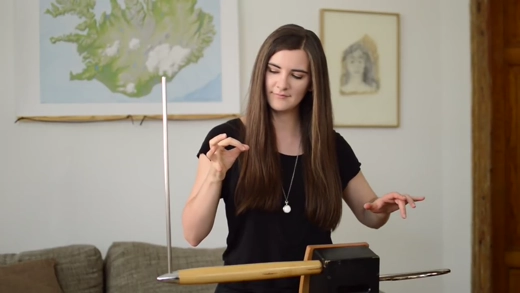

    
    
    
    
    
    

<!-- PROJECT LOGO -->
 

  <h3 align="center"> Ultrasonic theremin</h3>
  

  

   A Kids Project using RaspberryPi (Python + SonicPi)
     
    <a href="https://github.com/RabihND/AP2021-2022-Final"><strong>Explore the documents »</strong></a>
     
     
  

---

<!-- TABLE OF CONTENTS -->

  
Table of Contents
 
  <ol>
    <li><a href="#about-the-project">About The Project</a></li>
    <li><a href="#parts">Parts</a></li>
    <li><a href="#results">Results</a></li>
    <li><a href="#license">License</a></li>
    <li><a href="#refenences">Refenences</a></li>
    <li><a href="#contact">Contact</a></li>
    <li><a href="#roadmap">Roadmap</a></li>
  </ol>

<!-- ABOUT THE PROJECT -->
## About The Project

  
  

The <b>theremin</b> <i>(/ˈθɛrəmɪn/; originally known as the ætherphone/ether phone, thereminophone or termenvox/thereminvox)</i> is an electronic musical instrument controlled without physical contact by the thereminist (performer). It is named after its inventor, Leon Theremin, who patented the device in 1928.

The instrument's controlling section usually <b>consists of two metal antennas</b> that sense the relative position of the thereminist's hands and <b>control oscillators for frequency with one hand, and amplitude (volume) with the other.</b> The electric signals from the theremin are amplified and sent to a loudspeaker.

>
The sound of the instrument is often associated with eerie situations. Thus, the theremin has been used in movie soundtracks such as Miklós Rózsa's Spellbound and The Lost Weekend, Bernard Herrmann's The Day the Earth Stood Still, and Justin Hurwitz's First Man, as well as in theme songs for television shows such as the ITV drama Midsomer Murders and the Disney+ series Loki, the latter composed by Natalie Holt. The theremin is also used in concert music (especially avant-garde and 20th- and 21st-century new music), and in popular music genres such as rock.

(<a href="#top">back to top</a>)

### Built With

Major frameworks/libraries used in this project:

* [Python 3.10](https://www.python.org/)
* [Sonic Pi](https://sonic-pi.net/)

(<a href="#top">back to top</a>)

<!-- PARTS -->
## Parts
**1. What you will learn?**

By building an ultrasonic theremin, you will learn:
- How to **detect distances** with an ultrasonic distance sensor.
- How to **communicate** variables between Sonic Pi and Python.

 
**2. What you will need?** 

- **2.1. Hardware:** 
    - 330Ω Resistor
    - 470Ω Resistor
    - Solderless Breadboard
    - Ultrasonic Distance Sensor
    - 3 x Male to Male Jumper Leads
    - 4 x Male to Female Jumper Leads

**3. GameOverWindow Class** (GUI_Window)

The resulting window, which shows the player's loss(+) or victory(-).
- **display_text()**: Return a text with include the result of the game.(Win/Loss)

**4. Splash Screen Class** (GUI_Windows)
>{⌛} 

(<a href="#top">back to top</a>)

<!-- RESULTS -->
## Results

**GUI OUTPUT:**

ScreenShoot Preview 🖼️

  <body>
    
  

  </body>

---

**TERMINAL OUTPUT:**

ScreenShoot Preview 🖼️

  <body>
    
  

  </body>

(<a href="#top">back to top</a>)

<!-- LICENSE -->
## License

Distributed under the MIT License. See `LICENSE.txt` for more information.

(<a href="#top">back to top</a>)

<!-- REFERENCES -->
## Refenences

🔎

(<a href="#top">back to top</a>)

<!-- CONTACT -->
## Contacts

Rabih ND - [@RabihND](https://github.com/RabihND) 

**Project Link:** [https://github.com/RabihND/UltrasonicTheremin](https://github.com/RabihND/UltrasonicTheremin)

(<a href="#top">back to top</a>)

<!-- ROADMAP -->
## Roadmap

- [x] 

(<a href="#top">back to top</a>)

---

<!-- MARKDOWN LINKS & IMAGES -->
<!-- https://www.markdownguide.org/basic-syntax/#reference-style-links -->
[version-sheild]: https://img.shields.io/github/v/release/RabihND/AP2021-2022-Final?color=14adfa&logo=Semantic%20Web&logoColor=14adfa&style=for-the-badge
[download-sheild]: https://img.shields.io/github/downloads/RabihND/AP2021-2022-Final/total?logo=App%20Store&logoColor=white&style=for-the-badge
[line-sheild]: https://img.shields.io/tokei/lines/github/RabihND/AP2021-2022-Final?color=green&logo=visualstudiocode&style=for-the-badge
[contributors-shield]: https://img.shields.io/github/contributors/RabihND/AP2021-2022-Final?color=6fd671&logo=WhiteSource&style=for-the-badge
[contributors-url]: https://github.com/RabihND/AP2021-2022-Final/graphs/contributors
[forks-shield]: https://img.shields.io/github/forks/RabihND/AP2021-2022-Final?color=cccccc&logo=Node-RED&style=for-the-badge
[forks-url]: https://github.com/RabihND/AP2021-2022-Final//network/members
[stars-shield]: https://img.shields.io/github/stars/RabihND/AP2021-2022-Final?color=8e6be8&logo=Ethereum&logoColor=8e6be8&style=for-the-badge
[stars-url]: https://github.com/RabihND/AP2021-2022-Final/stargazers
[license-shield]: https://img.shields.io/github/license/RabihND/AP2021-2022-Final?color=%2363afdb&logo=letsencrypt&style=for-the-badge
[license-url]: https://github.com/RabihND/AP2021-2022-Final/master/LICENSE.txt
